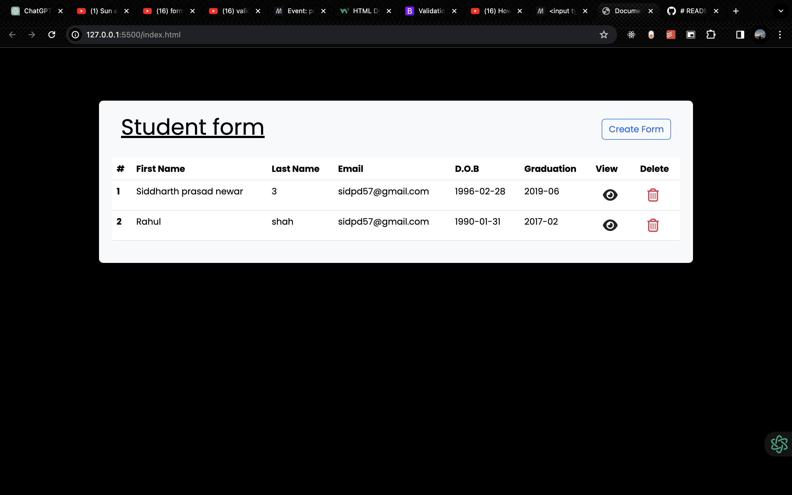
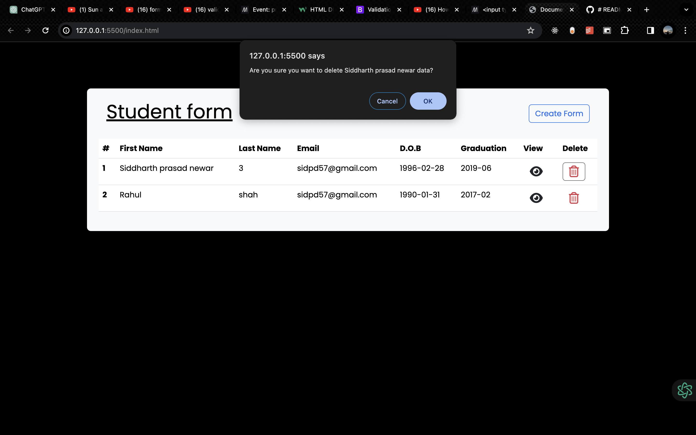
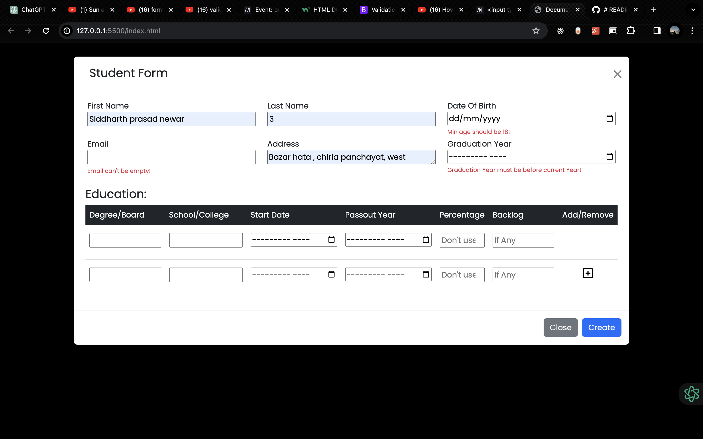
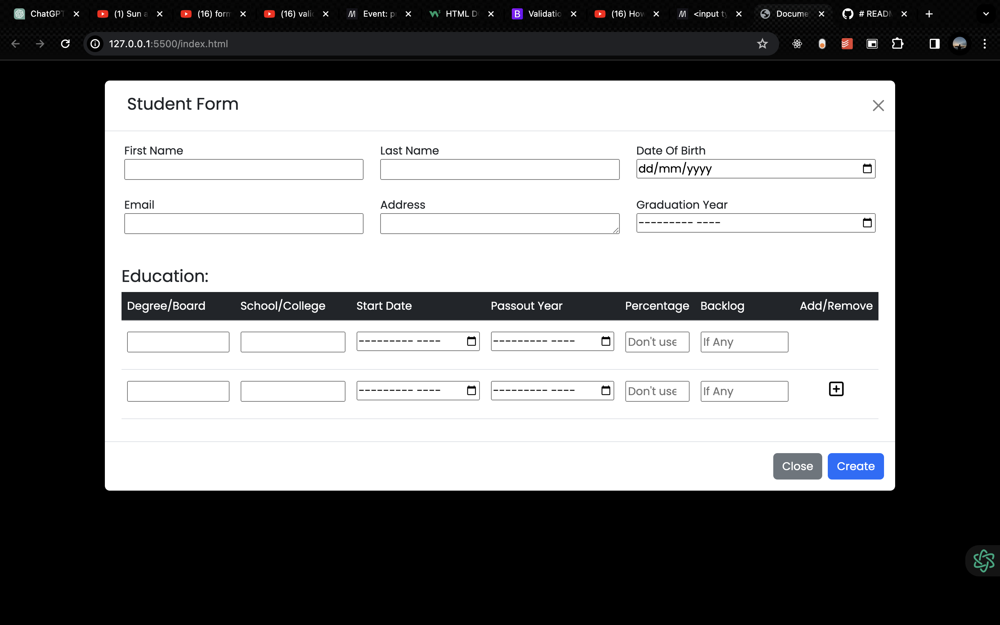

# Student Form Management System

This project is a web-based application that allows users to manage student information using a form interface. Users can create, view, update, and delete student records.

## Features

- **Create:** Users can create new student records by filling out a form.
- **View:** Users can view detailed information about each student record.
- **Update:** Users can update existing student records.
- **Delete:** Users can delete student records.
- **Validation:** The form includes validation to ensure that required fields are filled out correctly.
- **Education Information:** Users can input education details for each student, including degree, college, start date, passout year, percentage, and backlog.

## Technologies Used

- HTML
- CSS
- JavaScript
- Bootstrap 5

## How to Use

1. Clone the repository to your local machine.
2. Open the `index.html` file in your web browser.
3. Click on the "Create Form" button to open the modal for creating a new student record.
4. Fill out the form with the necessary information.
5. Click "Create" to submit the form and add the student record.
6. To view, update, or delete existing student records, navigate through the table and use the corresponding buttons.

## Screenshots

## Contributing

Contributions are welcome! If you'd like to contribute to this project, please fork the repository and submit a pull request.

## Have a look
 https://student-form-multiple-users-kds49ir5d-sidpd51s-projects.vercel.app/

